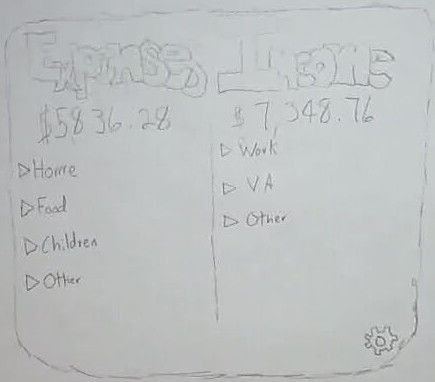

# Personal Budget WebApp

- The purpose of this project is to solve an issue I have tracking my monthly expenses. This application will solve that issue by prominently displaying my monthly budget and expenses in a clean and easy to read format. Simplicity is key for this project.

## Features
- User can insert the relevant information for their monthly budget.
- User will be able to login and view their budget.
- User will be able to update their budget.
- User will be able to delete their budget.

## Roadmap
- Automatically update the budget each month based on the vendor API's that may be available.
- Add a feature to allow the user to add their own categories.
- Predict yearly available amounts that can be saved based on the user's monthly budget.
- AI?

## Initial Mockup

